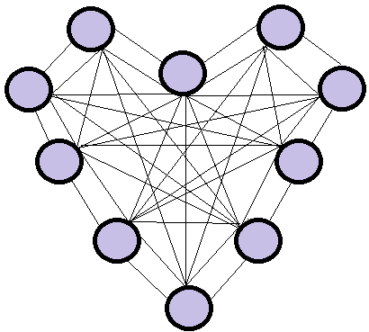

---
output:
  html_document: default
---

{height=200px, width=200px}

## 1 Use Case

Dating and matchmaking has always been one of the main quests in people's lives.
Finding the right partner for relationships, marriage or just an occasional rendez-vous, most times, is an ongoing trial-and-error process which comes with many disappointments, lengthy searches and hard feelings. Subsequently, many people prefer to make use of matchmaking services, apps and events to find a suitable partner faster, easier and more reliably. Thankfully, data can be used to simplify this whole process and predict a possible match.

### 1.1 Our Goal 

In this project we want to visualize and predict possible matches of individuals, based on the forecast whether they will like each other or not. 
Therefore, we will analyze a speed dating data set. In doing so, we will apply different visualization and prediction methods which we learned in the Machine Learning class. The whole project will be implemented in an R Markdown file.

### 1.2 The Dataset 

In this project we used one data set from a speed dating experiment with different variables on the participants self-assessment and assessment of their speed dating partners. The data set is linked and leads directly to the correct html page:

* [link](https://www.kaggle.com/annavictoria/speed-dating-experiment/data) This is the link to our data set. It contains 195 columns and 8'378 rows.

### 1.3 The Process

The process of this project will contain the following three main steps:

* First of all we will check the data for errors and make the necessary adjustments.
* Afterwards we will display and explore the processed data in various visualizations. 
* In the last part we will create predictions by applying various forecasting and machine learning tools.

### 1.4 A Love Story

This project work aims to create a prediction model which can, based on its inputs, forecast whether two persons might like each other and be a possible match for further dating or not.
Such a model can be used and applied in various dating apps, by matchmaking agencies or on speed dating events, increasing the success rate of the services they offer while spending less time, costs and effort to find and connect matching customers. 
