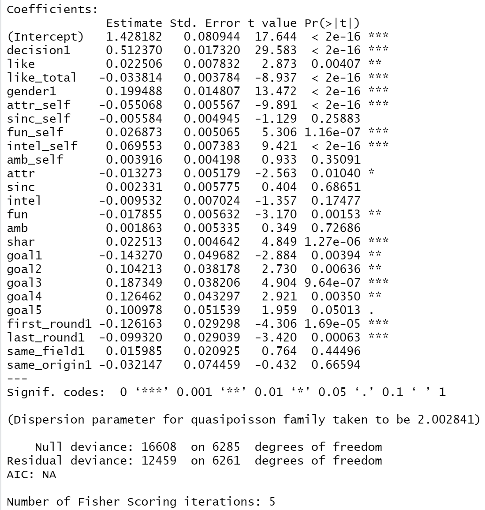
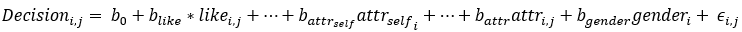
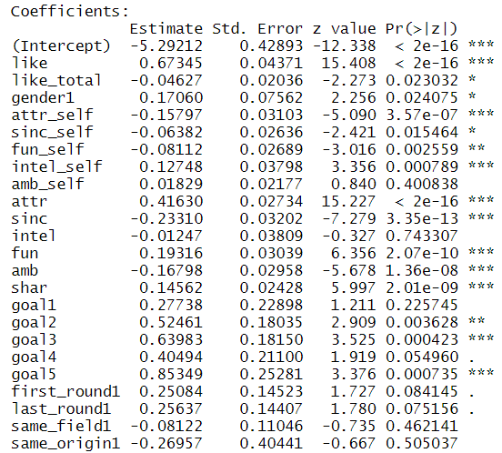
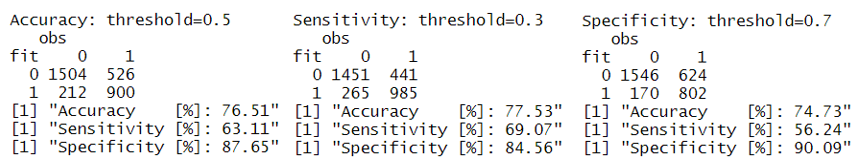
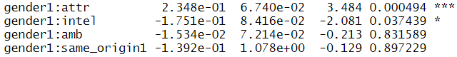
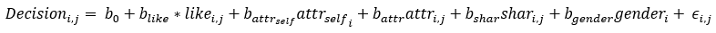
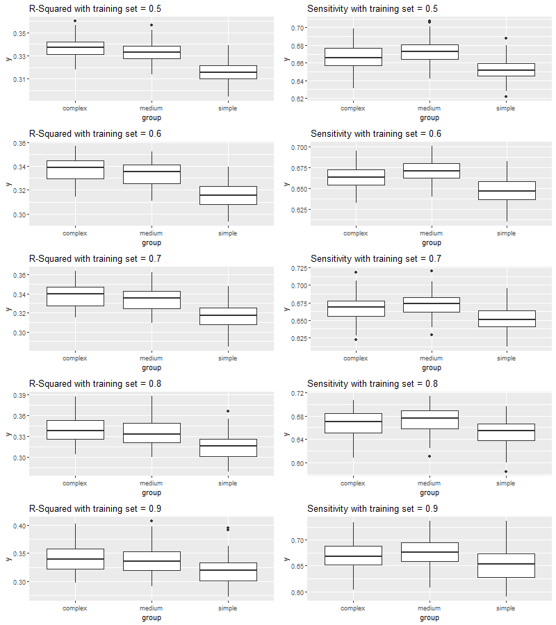

---
output:
  html_document: default
---
## 4 Generalised Linear Model: Poisson and Binomial Distribution

In this section, we will apply the GLM model, using Poisson distribution on the variable 'decision_count' and using Binomial distribution on the 'decision' variable. We will draw a basic understanding of the 'decision_count' variables with the Poisson distribution. However, as predicting the variable 'decision' is the goal of this project, we will put greater effort in the GLM model with Binomial distribution, also known as Logistic Regression. As the first steps towards our goal to predict partner decision, we will talk about performance measurements and throw a cross validation.

```{r message=FALSE, warning=FALSE, include=FALSE}
data.spd <- read.csv("../Data/cleaned_speed_dating.csv")

cols <- c("gender", "decision", "first_round", "last_round", "same_field", "same_origin", "goal")
data.spd[cols] <- lapply(data.spd[cols], factor)

data.glm <- data.spd %>%dplyr:: select(-c(iid, match, pid))

dim(data.glm)

```

### 4.1 GLM: Poisson Distribution 

We use Poisson distribution to manipulate count data. Here, we will use 'decision_count' as our count data with decision count indicating the total number of yes per participant as in a partners' mutual agreement to meet again.

#### 4.1.1 Poisson Analysis

Here we do some analysis to ensure that the decision_count as a variable is applicable to be evaluated with Poisson distribution. As we have seen in section 3.1 Data Exploration, the histogram has a relatively close follow of a poisson distribution. We also check mean and variance to determine whether it fits or if it is over/under-dispersion

```{r echo=FALSE, results='hide'}
mean(data.glm$decision_count)
var(data.glm$decision_count)
```

As we determine the mean and variance of the decision variable, Var > mean - suggest we don't have poisson condition mean=var, but we have overdispersion, meaning a quasipoisson distribution would be more adapted.

#### 4.1.2 GLM: Poisson Model

We fit a Poisson model to the data and interpret the regression coefficients using the glm() function. Important: specify family='poisson'

```{r, echo=TRUE, results='hide'}
poisson.dating <- glm(decision_count~., family = "poisson", data = data.glm)
summary(poisson.dating)
```

After running the model, we determine from the residual deviance is about 12459 on 6261 degrees of freedom. If there was no overdispersion, we would
expect the residual deviance to be about the same as degrees of freedom. We can therefore conclude that the model is overdispersed

#### 4.1.3 GLM: QuasiPoisson Model

When modelling count data, overdispersion is the rule not the exception. So now fit the quasipoisson model and look at the dispersion parameter.

```{r message=FALSE, warning=FALSE, results='hide'}
quasipoisson.dating <- glm(decision_count~., family = 'quasipoisson', data = data.glm)
summary(quasipoisson.dating)
```
<center>
{height=400px, width=400px}
</center>
Comparing estimated regression coefficient and standard Error between both models in one table

```{r message=FALSE, warning=FALSE, result='hide'}
c.p = coef(poisson.dating)
c.qp = coef(quasipoisson.dating)
s.p = se.coef(poisson.dating)
s.qp = se.coef(quasipoisson.dating)
cbind(c.p,s.p,c.qp,s.qp)
```

Notice coefficient are identical while Std Error is higher in quasipoisson. Indeed, this is always the case when comparing the regression coefficients for a Poisson the corresponding quasipoisson model. The real difference between these two model is on the standard errors of the estimates and, as a consequence, on the p-values. We use s.qp / s.p --> to get the dispersion parameter = 1.41

We notice that all the predictors that are significant to the 'decision_count' variable from the results of poisson and quasi-poisson models play a significant role in the models. We determined that using anova function.

```{r, warning=FALSE, message=FALSE}
quasi.dating <- update(quasipoisson.dating, . ~ . - goal)
anova(quasipoisson.dating, quasi.dating, test = "F")
```

In this example we use goal and show that it has a strong evidence that it plays a role. We do similar procedure using other significant predictors (gender, like_total) and we get similar results.

Then finally we estimate a robust covariance matrix of parameters

```{r , message=FALSE, warning=FALSE, results='hide'}
vcovHC(quasipoisson.dating, type='HC0')
```

As shown all the predictors with high significance p-values in quasipoisson GLM model, show strong evidences from anova test that they play a role when predicting the response variable decision_count

**Conclusion:**
The count data 'decision_count' is over dispersed so we fit it in a quasipoisson model. The model shows significance of all predictors used, for example, the self attractiveness has a negative coefficient suggesting that people who find themselves more attractive tend to have high standards/expectation and don't say yes as often, while with goal3 (to meet new people) a relatively higher positive coefficient suggests that the participants with such a goal will tend to say more yes to meet other again which makes sense in that perspective. We also conclude that all the predictors with high significance p-values in quasipoisson model, show strong evidences from anova test that they play a role when predicting the response variable decision_count.

### 4.2 GLM: Binomial Distribution
We use Binomial distribution to manipulate binary and binomial data. Here, we will use binary data to predict the variable 'decision' (0 / 1). If a person is willing to see his/her partner again then it is a yes=1, otherwise it is a no=0.
<center>
{height=25px}
</center>
In order to compare the model's performance, we will split the data in training and testing set. We use the createDataPartition from the caret package with a split of 80% to training data and 20% testing data. This method hold the same proportion of response variable in both sets. For instance we know that there is 55% of 'no' and 45% of 'yes', this method of splitting data will hold this ratio in the training and testing set.

```{r message=FALSE, warning=FALSE, include=FALSE}
data.glm <- data.glm %>% dplyr::select(-c(decision_count))
dim(data.glm)

set.seed(123)
trainIndex <- createDataPartition(data.glm$decision, p=0.8, list=F, times= 1)
train <- data.glm[trainIndex, ]
test <- data.glm[-trainIndex, ]
test.truth <- test[,1]
```

#### 4.2.1 Function: Model Evaluation

We created a function that evaluates the model performance as a confusion matrix. It takes the model prediction and round it to 0 or 1 depending if the probability is greater or lower than a certain threshold, so we can play with sensitivity, specificity and accuracy. 
<center>
image: {height=350px, width=350px}
*source: HSLU, Machine Learning and Predictive Modeling, week 5*
</center>
**Accuracy:** middle point between Sensitivity and Specificity (threshold = 0.5)

**Sensitivity:** increase True Positive / decrease False Negative (threshold = 0.3)
Probabilities greater than 30% will be considered as 'yes' (1), and probabilities under 30% will be considered as 'no' (0).
*False Negative (Type II): predicting a 'no' when it's  a 'yes'*

**Specificity:** increase True Negative / decrease False Positive --> threshold = 0.7
Probabilities greater than 70% will be considered as a 'yes' (1), and probabilities under 70% will be considered as 'no' (0). 
*False positive (Type I): predicting a 'yes' when it's a 'no'*


```{r message=FALSE, warning=FALSE, include=FALSE}
model_evaluation<- function(model_fit,data,response_var_name, threshold) {
  fitted<-ifelse(model_fit>threshold,yes=1,no=0)
  data.obs_fit<-data.frame(obs=data[response_var_name],
                           fit=fitted)
  table.obs_fit<-table(fit=data.obs_fit[,2],
                       obs=data.obs_fit[,1])
  print(table.obs_fit)
  tp<-table.obs_fit[2,2]
  tn<-table.obs_fit[1,1]
  success<-tp+tn
  fp<-table.obs_fit[2,1]
  fn<-table.obs_fit[1,2]
  total<-success+fn+fp
  accuracy<-round((success/total)*100,2)
  sensitivity<-round((tp/(tp+fn))*100,2)
  specificity<-round((tn/(tn+fp))*100,2)
  print(paste('Accuracy    [%]:', accuracy))
  print(paste('Sensitivity [%]:',sensitivity))
  print(paste('Specificity [%]:',specificity))
}
```

#### 4.2.2 Fit GLM Binomial Model 1: All Variable, no Interaction

We will first, fit a GLM model with binomial distribution, including all predictors and no interaction.

{height=300px, width=275px}
{height=100px}

```{r message=FALSE, warning=FALSE, include=FALSE}
set.seed(123)
glm.model.1 <- glm(decision~., data=train, family = 'binomial')
summary(glm.model.1)
```

```{r eval=FALSE, message=FALSE, warning=FALSE, include=FALSE}
set.seed(123)
predict.glm.model.1 <- predict(glm.model.1, newdata=test)
cat('Accuracy: threshold=0.5\n')
#Evaluate the model towards accuracy (threshold = 0.5)
model_evaluation(predict.glm.model.1,test,'decision', 0.5)
cat('\nSensitivity: threshold=0.3\n')
#Evaluate the model towards sensitivity (threshold = 0.3)
model_evaluation(predict.glm.model.1,test,'decision',0.3)
cat('\nSpecificity: threshold=0.7\n')
#Evaluate the model towards specificity (threshold = 0.7)
model_evaluation(predict.glm.model.1,test,'decision',0.7)

conf$table
acc<-round(conf$overall["Accuracy"]*100,2)
sens<-round(conf$byClass["Sensitivity"]*100,2)
spec<-round(conf$byClass["Specificity"]*100,2)
tab<-matrix(c(acc,sens,spec), ncol=3)
colnames(tab)<-c("Accuracy [%]","Sensitivity [%]","Specificity [%]")
rownames(tab)<-c("")
tab<-as.table(tab)
tab
```

**Conclusion**
As a medium complexity model (20 predictors, no interaction), the results are really good, with an overall accuracy of 78% with a threshold of 0.3. We have decided to observe the Sensitivity, that means increasing the True Positive and decreasing the False Negative. In other words, we want to improve the accuracy of prediction on 'yes' and reduce the number of wrong prediction 'no' when it's a 'yes'.
The reason of this decision rely on the primary goal of the project, predicting a 'match'. To have a 'match' the two partners need to give a 'yes', therefore if our prediction are accurate on the 'yes', we increase our chance of correctly predicting a 'match'.
<center>
Mathematically:

$0*0=0=>NoMatch$

$0*1=0=>NoMatch$

$1*0=0=>NoMatch$

**$1*1=0=>Match$**
</center>
As you can see, the chance of a 'match' are lower. Plus the distribution of 'yes' is inferior to 'no' (45% of 'yes' and 55% of 'no'). Therefore we need to improve the accuracy on True Positive.

**Problem:** We increase the False Positive (predicting a 'yes' when it's a 'no'), so we might predict more 'match' than in reality. (Our client are looking for meeting people, so if we give them more date than expected, is that a real problem?) 
The one possible issue, is to forecast a match when someone really didn't like the partner so we need to ensure that the Specificity is not too low. (Specificity around 40% will be avoid)

#### 4.2.3 GLM Binomial Model 2: Interaction 'Gender'
Now we will improve the model with interaction. One of our team member knows an expert in psychology, so he ask for background theory to understand decision process in partner selection. 
In relationship psychology, gender play a key role in partner selection. The theory states that Male pay more attention to physical appearance, so attractivity. On the other hand, Female look for social status, that means, intellectual potential, ambition and origin. Therefore, we will explore those interactions.

```{r message=FALSE, warning=FALSE, include=FALSE}
set.seed(123)
glm.model.2 <- glm(decision~.+attr*gender+intel*gender+amb*gender+same_origin*gender
                   , data=train, family = 'binomial')
summary(glm.model.2)
```
<center>
{height=50px}
</center>
Apparently there is a strong interaction between attractivity and gender. Also, we have interaction with intelligence. Therefore, it seems psychological theory is correct about those interactions. 

Let's evaluate the performance of this new model

```{r echo=FALSE, message=FALSE, warning=FALSE}
set.seed(123)
predict.glm.model.2<- predict(glm.model.2, test)
pred<-ifelse(predict.glm.model.2>0.3,1,0)
conf<-confusionMatrix(as.factor(pred),test.truth, positive='1')
conf$table
acc<-round(conf$overall["Accuracy"]*100,2)
sens<-round(conf$byClass["Sensitivity"]*100,2)
spec<-round(conf$byClass["Specificity"]*100,2)
tab<-matrix(c(acc,sens,spec), ncol=3)
colnames(tab)<-c("Accuracy [%]","Sensitivity [%]","Specificity [%]")
rownames(tab)<-c("")
tab<-as.table(tab)
tab
```

The interactions with gender does not improve the model. That is problem with complex model, it can bring confusion to the model. We should perform a simpler model. First, we will interpret some of those result. 

*Source:* 
* *Raymond Fisman, Sheena S. Iyengar, Emir Kamenica, Itamar Simonson, May 2006, "Gender Differences In Mate Selection:Evidence From a Speed Dating Experiment"*
* *Mélanie Vanderschelden, 2006, "Position sociale et choix du conjoint : des différences marquées entre hommes et femmes"(french)*
* *Kaufmann, 1993 Sociologie du couple, Paris: PUF, 5e édition 2010 (french)*
* *Vincent SILENA, master student in psychology at the Lausanne University*

#### 4.2.4 Variable Interpretation
Due to the use of a link function, we must transform the coefficients to be able to interpret them. All the interpreted variables below are significant at a confidence level of 95% or 99% at least. 
We will start by a 'self' variable.

**Self rating attractivity (attr_self):**
```{r, warning=FALSE, message=FALSE}
round(exp(coef(glm.model.2)['attr_self']),1)
```

When increasing your personal 'attractivity' score by one, the odds, to give a positive answer, decrease by 20%. 
There may have different interpretation to this coefficient, however based on our understanding of selection bias in partner selection process, giving yourself a higher grade, increase your standards and therefore engage a more selective behavior. The logic behind, is if you think you are extremely attractive, you expect to have someone as attractive as you.
We can see this negative relationship in the other self attributes, like funny and sincerity (except for intelligence and ambition but this variable is not significant).

**attractivity (attr):**
```{r, warning=FALSE, message=FALSE}
round(exp(coef(glm.model.2)['attr']),1)
```

When increasing the attractivity score of your partner by 1, the odds increase by 40%. That means more attractive is your partner, more likely you willing to see him/her again (decision = 'yes'). This variable is maybe one of the most important variable of the decision process in partner selection, we will it in further models (Random Forest).

#### 4.2.5 GLM Binomial Model 3: Simple Model
As we have seen before the model with interaction (complex model), does not yield better performance. Therefore, we will build a simple model, with 5 predictors, arbitrary selected. Then in the next section we will throw a Cross Validation to select the best model between the simple(5 predictors), the middle (20 predictors, no interaction), the complex (20 predictors, 4 interactions).

{height=25px}

All predictors are significant at the maximum level of confidence (output not displayed)

```{r echo=FALSE, message=FALSE, warning=FALSE}
set.seed(123)
glm.model.3<-glm(decision~like+attr_self+attr+shar+gender, data=train, family='binomial')
predict.glm.model.3<- predict(glm.model.3, test)
pred<-ifelse(predict.glm.model.3>0.3,1,0)
conf<-confusionMatrix(as.factor(pred),test.truth, positive='1')
conf$table
acc<-round(conf$overall["Accuracy"]*100,2)
sens<-round(conf$byClass["Sensitivity"]*100,2)
spec<-round(conf$byClass["Specificity"]*100,2)
tab<-matrix(c(acc,sens,spec), ncol=3)
colnames(tab)<-c("Accuracy [%]","Sensitivity [%]","Specificity [%]")
rownames(tab)<-c("")
tab<-as.table(tab)
tab
```

The simple model yields identical performance as the others. However, this result must be considered with precautions, as all models were build with the same training and testing set, therefore those result are not robust. We will throw a Cross Validation to evaluate the best model. 

#### 4.2.6 Cross Validation

We will evaluate 3 different GLM models: simple (5 predictors), medium (20 predictors,no interaction), and complex (20 predictors with 4 interactions). We will split training and testing data 100 times with different splitting ratio(50/50,60/40, 70/30, 80/20, 90/10). The purpose of this manipulation is to evaluate which model is the more robust and also to determined the splitting ratio, which yield the best result. 
We will evaluate the model's performances based on sensitivity and R-squared. R-squared is not a good measure for binary data, but we included for two reasons. First, to ensure a robust cross validation, we want to include another estimator. And R-squared is independent off the round-up operation made in the sensitivity calculations, set to 0.3 (confusion matrix). 

```{r include=FALSE}
set.seed(111)
r.squared.simple <- c()
sensitivity.simple <-c()
r.squared.medium <- c()
sensitivity.medium <-c()
r.squared.complex <- c()
sensitivity.complex <-c()

cross_validation <- function(ratio, n) {
  for(i in 1:n){
    ##prepare data##
    trainIndex <- createDataPartition(data.glm$decision, p=ratio, list=F, times= 1)
    train <- data.glm[trainIndex, ]
    test <- data.glm[-trainIndex, ]
    test.truth <- test[,1]
    
    ## medium model ##
    glm.cross.1<-glm(decision~.,
                     data=train,
                     family='binomial')
    predict.glm.cross.1<-predict(glm.cross.1, newdata=test)
    r.squared.medium[i]<-cor(predict.glm.cross.1, as.numeric(test$decision))^2
    round_predict.glm.cross.1<-ifelse(predict.glm.cross.1>0.3,yes=1,no=0)
    conf<-confusionMatrix(as.factor(round_predict.glm.cross.1),test.truth, positive='1')
    sensitivity.medium[i]<-conf$table[2,2]/(conf$table[1,2]+conf$table[2,2])
    
    ## complex model ##
    glm.cross.2<-glm(decision~.+attr*gender+intel*gender+amb*gender+same_origin*gender,
                     data=train,
                     family='binomial')
    predict.glm.cross.2<-predict(glm.cross.2, newdata=test)
    r.squared.complex[i]<-cor(predict.glm.cross.2, as.numeric(test$decision))^2
    round_predict.glm.cross.2<-ifelse(predict.glm.cross.2>0.3,yes=1,no=0)
    conf<-confusionMatrix(as.factor(round_predict.glm.cross.2),test.truth, positive='1')
    sensitivity.complex[i]<-conf$table[2,2]/(conf$table[1,2]+conf$table[2,2])
    
    ## simple model ##
    glm.cross.3<-glm(decision~like+attr_self+attr+shar+gender,
                     data=train,
                     family='binomial')
    predict.glm.cross.3<-predict(glm.cross.3, newdata=test)
    r.squared.simple[i]<-cor(predict.glm.cross.3, as.numeric(test$decision))^2
    round_predict.glm.cross.3<-ifelse(predict.glm.cross.3>0.3,yes=1,no=0)
    conf<-confusionMatrix(as.factor(round_predict.glm.cross.3),test.truth, positive='1')
    sensitivity.simple[i]<-conf$table[2,2]/(conf$table[1,2]+conf$table[2,2])
  }
  int<-append(r.squared.simple,r.squared.medium)
  r_final<-append(int,r.squared.complex)
  df_r<-data.frame(y=r_final,group=rep(c('simple', 'medium','complex'), each=n))
  int<-append(sensitivity.simple,sensitivity.medium)
  sens_final<-append(int,sensitivity.complex)
  df_sens<-data.frame(y=sens_final,group=rep(c('simple', 'medium','complex'), each=n))
  func_return<-list('df_r'=df_r, 'df_sens'=df_sens)
  return(func_return)
}
```

```{r include=FALSE}
set.seed(5)
cv_50<-cross_validation(0.5,100)
df_r_50<-cv_50[['df_r']]
df_sens_50<-cv_50[['df_sens']]
cv_60<-cross_validation(0.6, 100)
df_r_60<-cv_60[['df_r']]
df_sens_60<-cv_60[['df_sens']]
cv_70<-cross_validation(0.7,100)
df_r_70<-cv_70[['df_r']]
df_sens_70<-cv_70[['df_sens']]
cv_80<-cross_validation(0.8,100)
df_r_80<-cv_80[['df_r']]
df_sens_80<-cv_80[['df_sens']]
cv_90<-cross_validation(0.9,100)
df_r_90<-cv_90[['df_r']]
df_sens_90<-cv_90[['df_sens']]
```
```{r, include=FALSE}
box_r_50<-ggplot(df_r_50, aes(x=group, y=y))+
  geom_boxplot()+
  ggtitle('R-Squared with training set = 0.5')

box_sens_50<-ggplot(df_sens_50, aes(x=group, y=y))+
  geom_boxplot()+
  ggtitle('Sensitivity with training set = 0.5')

box_r_60<-ggplot(df_r_60, aes(x=group, y=y))+
  geom_boxplot()+
  ggtitle('R-Squared with training set = 0.6')

box_sens_60<-ggplot(df_sens_60, aes(x=group, y=y))+
  geom_boxplot()+
  ggtitle('Sensitivity with training set = 0.6')

box_r_70<-ggplot(df_r_70, aes(x=group, y=y))+
  geom_boxplot()+
  ggtitle('R-Squared with training set = 0.7')

box_sens_70<-ggplot(df_sens_70, aes(x=group, y=y))+
  geom_boxplot()+
  ggtitle('Sensitivity with training set = 0.7')

box_r_80<-ggplot(df_r_80, aes(x=group, y=y))+
  geom_boxplot()+
  ggtitle('R-Squared with training set = 0.8')

box_sens_80<-ggplot(df_sens_80, aes(x=group, y=y))+
  geom_boxplot()+
  ggtitle('Sensitivity with training set = 0.8')

box_r_90<-ggplot(df_r_90, aes(x=group, y=y))+
  geom_boxplot()+
  ggtitle('R-Squared with training set = 0.9')

box_sens_90<-ggplot(df_sens_90, aes(x=group, y=y))+
  geom_boxplot()+
  ggtitle('Sensitivity with training set = 0.9')
```

```{r eval=FALSE, include=FALSE}
#png("cross_validation.png",width= 800,height= 900)
plot_grid(box_r_50,box_sens_50,box_r_60,box_sens_60,box_r_70,box_sens_70,
          box_r_80,box_sens_80,box_r_90,box_sens_90,ncol=2)
#dev.off()
```



We observe from this chart, the model with the highest sensitivity is the medium complex model (20 predictors, no interaction). The R squared estimator, indicates the simple model as the best model. As the two estimators have different conclusion, and we will base our analysis on the sensitivity measure, we will pick the medium complexity model as the most suitable GLM model of the project. Another alternative, would be to build a model with a mix of the three models.

```{r echo=FALSE, fig.width=8, fig.height=3.5, fig.align='center'}
median_sensitivity<-c(median(df_sens_50[,1], na.rm=TRUE),
                    median(df_sens_60[,1], na.rm=TRUE),
                    median(df_sens_70[,1], na.rm=TRUE),
                    median(df_sens_80[,1], na.rm=TRUE),
                    median(df_sens_90[,1], na.rm=TRUE))
splitting_ratio<-c(50,60,70,80,90)
plot(splitting_ratio,median_sensitivity,type = "b", lty = 1, main='Median Sensitivity & Splitting Ratio')
```

As we can observe, best splitting ratio to yield the highest median sensitivity is the 80/20 ratio. The logic want, that we apply the ratio that performs the best results to all models. However, the performance are based on the GLM model, so we cannot apply those result raw on other models. Especially with Neural Network and Support Vector Machine (SVM), that are particularly exposed to risk of overfitting, GLM are less exposed to this risk. Therefore, we will still apply the 80%/20% splitting ratio, as it is a widespread technique but we will keep in mind that we are exposed to overfit. 

### 4.3 General Conclusion on GLM Model

From the Poisson model we conclude that all the predictors with high significance p-values in quasipoisson model, show strong evidences from anova test that they play a role when predicting the response variable decision_count. We also gain meaningful insights on decision process in partner selection. People with higher self esteem (high personal score) tend to have a more selective behavior (lower number of decision_count). Moreover, we observed the predictor 'goal' has a significant impact on the decision process. Even if 'count_decision' is not our primary goal in this project, our team drew meaningful and useful conclusion to achieve our goal..
From the Binomial models, we have conclude that the GLM model with all predictors and no interaction yield the best sensitivity, based on Cross Validation and we build valuable knowledge from the three models. According, to psychology theory in relationship, we have observed a strong interaction between gender and attractivity and aslo with intelligence. Lastly, we have proved that 'attractivity', 'like' and many other predictors were significative at the maximum level of confidence.
Therefore, with GLM models our team were able to build a more general understanding of our data set and how the variables interact with each other. In addition, our team can use those knowledge to improve future models and meet our business goal. 

**Pros GLM model:**

* *Simplicity*: easy to apply
* *Manipulation*: easy to manipulate, add and remove predictors
* *Knowledge*: easy to interpret the coefficients and help in data set understanding 
* *Speed*: extremely fast

**Cons GLM model:**

* *Performance*: limited in complexity, so in performance

#### Performance summary

info          | GLM simple | GLM medium    | GLM complex  |   
------------- | ---------- | ------------- | ------------ |
Accuracy:     |     76.26 %|    **77.79 %**|      77.56 % |
Sensitivity:  |     67.18 %|       69.47  %|   **69.71 %**| 
Specificity:  |     83.80 %|    **84.69 %**|      84.09 % |

**Best model:** GLM Binomial (20 predictors, no interaction)


